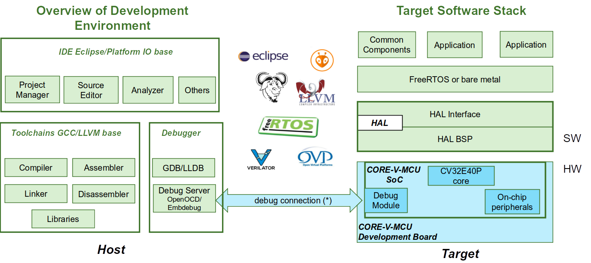

# OpenHW Project Concept Proposal: CORE-V Software Development Kit (SDK)
# This is Hugh making a change for test purposes

## Summary of project
This project aims to provide a stable and reasonably reliable Verilator system model for the CORE-V MCU (SoC and FPGA, comprising the cv32e40p). The purposes are
a. Predominantly, to be capable of supporting software development flows for which cycle accurate modeling of the target is appropriate, such as OS bring up and tool chain testing and optimization.
b. A supplemental purpose is to be capable of a kicking the tires verification of the CORE-V MCU SoC RTL.

From the Verilator Wikipedia entry:
(https://www.veripool.org/wiki/verilator)

Verilator is a free and open-source software tool capable of converting Synthesizable Verilog/SystemVerilog to a cycle-accurate cycle-accurate, 2-state behavioral model in C++ or SystemC.

##  Components

[Are there distinct components]

### Component 1 - [subtitle]

[Description of component 1]

### Component 2 - ...

## Why Open Hardware Group should do this project

[Justification for OpenHW Group leading the work. Why can we not have someone else do it, or just leave it to evolve in the community].

### Summary of Development

[Summary of top level work packages for each component]

### Summary of Timeline

[At least one milestone for each component]
1. [Milestone 1 (component 1)]
2. [Milestone 2 (component 1)]
3. ...

## OpenHW Members/Participants committed to participate

[List of corporate members]

- Ashling: Project leadership
- Embecosm: packed GCC and Clang/LLVM compiler tool chains
- Embecosm: software Verilator model of CORE-V-MCU for debug
- ...

## Project manager (PM)

## Technical project leader(s) (TPLs)

## Project documents

[List of documentation. I think this also includes other media]

## Summary of requirements

[Breakdown of the requirements].

## Industry landscape: description of competing, alternative, or related efforts in the industry

[Market analysis]

## External dependencies

### Open source technology and licensing

[list of external open source technology to be included]

- Verilator (GPL or Perl Artistic License) for software models
- ...

- Embdebug (GPL license with exception)

### Proprietary technology

[list of proprietary technology to be included.

## List of project outputs

## Other task groups impacted and associated resource requirements

[Describe dependencies on other task groups]

The obvious dependency is on the dev board and SoC being developed by the Hardward task group.

## OpenHW engineering staff resource plan: requirement and availability

[This is for people like Florian and Duncan. Should be minimal].

## Engineering resource supplied by members - requirement and availability

[What we need: quantities and skill specification]

### Compiler tool chain development, test and packaging

Skills required:
- experience of packaging the GNU compiler tool chain for commercial deployment on Linux, MacOS and Windows platforms; and
- experience of packaging the Clang/LLVM compiler tool chain for commercial deployment on Linux, MacOS and Windows platforms; and
- experience of GCC and Clang/LLVM regression testing within CI/CD environments.

Contributions:
- Embecosm: 1 engineer week twice per year to coincide with GCC and Clang/LLVM releases.

...

## OpenHW marketing resource - requirement and availability

[What we need from Rick and his team]

## Marketing resource supplied by members - requirement and availability

[What we need: quantities and skill specification]

## Funding supplied by OpenHW - requirement and availability

[What we need from Rick]

## Funding supplied by members - requirement and availability

[What we need from other members]

## Architecture diagram

I think we can lift the diagram from Duncan's slide here.

## Who would make use of OpenHW output

[End users of the project]

## Project license model

[Describe how the deliverables will be licensed]

## Description of initial code contribution, if required

[We can describe the upstream sources of the various tools here].

## Repository Structure

[Typically within the GitHub `openhwgroup` repo]

## Project distribution model

[How we ship]

## Preliminary Project plan

[This should be an outline of the likely work packages, effort, dependencies].

## Preliminary Risk Register

Risk is scored as likelihood (1-10) x impact (1-3) with mitigation required for any risk with score of 10 or more, of with an impact of 3 (project killer).

| Risk                          |   L |   I |   R | Mitigation                 |
|:----------------------------- | ---:| ---:| ---:|:---------------------------|
| First risk - Paragraph describing the risk | 3 | 3 | 15 | Paragraph describing mitigation steps |
| Second risk - Paragraph describing the risk | 3 | 3 | 15 | Paragraph describing mitigation steps |
